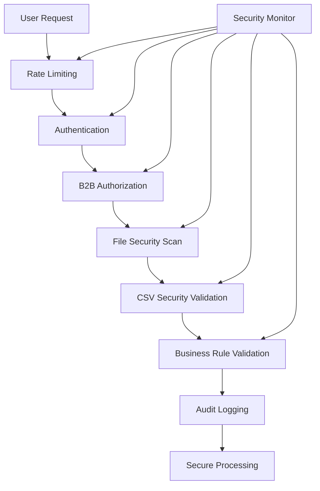

# B2B Bulk Operations Security Enhancements

## Overview

This document describes the comprehensive security enhancements implemented for B2B bulk operations in the AI Shopping Assistant, as per PROMPT 12.1 requirements.

## Security Architecture



## Security Features

### 1. Audit Logging System

**Module:** `security/audit-logger.ts`

- **Tamper-proof logging** with HMAC-SHA256 signatures
- **Chain integrity** through linked entry IDs
- **Automatic rotation** based on file size and date
- **Retention management** with configurable periods
- **Compliance reporting** with integrity verification

#### Audit Event Types
```typescript
enum AuditEventType {
  // Authentication
  AUTH_SUCCESS, AUTH_FAILURE, AUTH_B2B_REQUIRED,
  
  // Bulk operations
  BULK_UPLOAD_START, BULK_UPLOAD_SUCCESS, BULK_UPLOAD_FAILURE,
  BULK_VALIDATION_FAILURE,
  
  // Security events
  RATE_LIMIT_EXCEEDED, MALICIOUS_PAYLOAD_DETECTED,
  FILE_SIZE_EXCEEDED, UNAUTHORIZED_ACCESS,
  
  // Business rules
  ORDER_LIMIT_EXCEEDED, CREDIT_LIMIT_EXCEEDED,
  INVALID_SKU_PATTERN
}
```

### 2. B2B Authorization

**Module:** `security/b2b-authorization.ts`

#### Role-Based Access Control (RBAC)
```typescript
const B2B_ROLES = {
  BUYER: {
    permissions: ['bulk_order.create', 'bulk_order.view'],
    orderLimits: {
      dailyValue: 10000,
      monthlyValue: 100000,
      singleOrderValue: 5000,
      singleOrderItems: 100
    }
  },
  PURCHASING_MANAGER: {
    permissions: [...BUYER.permissions, 'bulk_order.approve'],
    orderLimits: { /* higher limits */ }
  },
  ACCOUNT_ADMIN: {
    permissions: [..., 'bulk_order.unlimited'],
    orderLimits: { /* highest limits */ }
  }
}
```

#### Permission Checks
- Bulk order creation/approval
- Contract pricing access
- Credit limit visibility
- Data export capabilities

#### Business Rules
- Order value limits (daily/monthly/per-order)
- Item count restrictions
- SKU pattern validation
- Credit limit enforcement

### 3. Enhanced CSV Security

**Module:** `bulk/secure-csv-parser.ts`

#### Threat Detection
- **SQL Injection**: Detects SQL keywords and patterns
- **Script Injection**: XSS, JavaScript, PHP detection
- **Path Traversal**: File system attack prevention
- **Command Injection**: Shell command detection
- **Binary Data**: Prevents binary/encoded payloads

#### Input Sanitization
```typescript
// Alphanumeric fields (SKU, Reference)
sanitized = input.replace(/[^a-zA-Z0-9\-_]/g, '');

// Text fields (Notes)
sanitized = input
  .replace(/&/g, '&amp;')
  .replace(/</g, '&lt;')
  .replace(/>/g, '&gt;');
```

### 4. File Security Scanner

**Module:** `security/file-scanner.ts`

#### File Validation
- **Size limits**: Configurable max file size
- **Type validation**: MIME type and extension checks
- **Magic number verification**: Validates file signatures
- **Content scanning**: Deep inspection for threats

#### Threat Detection
- Executable files (PE, ELF, Mach-O)
- Script files (PHP, Shell, Python)
- Malware signatures (including EICAR test)
- Archive bombs (ZIP, RAR, 7z)
- High entropy (encrypted) content

### 5. Authentication Enhancements

**Updated:** `api/ai-assistant/chat/auth.ts`

- Added `isB2B` flag to AuthResult
- Added `accountId` for B2B context
- Role-based B2B detection
- Session-based permissions

## Implementation Example

### Secure Bulk Upload Route

```typescript
// api/ai-assistant/bulk-upload/secure-route.ts

export async function POST(request: NextRequest) {
  const auditLogger = getAuditLogger();
  const b2bAuth = getB2BAuthorization();
  const fileScanner = getFileScanner();

  // 1. Rate limiting
  const rateLimitResult = await rateLimiter.check(clientId);
  
  // 2. Authentication & B2B check
  const authResult = await authenticateUser(request);
  if (!authResult.isB2B) {
    await auditLogger.logEvent(AuditEventType.AUTH_B2B_REQUIRED, {...});
    return forbidden();
  }

  // 3. File security scan
  const scanResult = await fileScanner.scanFile(file, filename, userId);
  if (!scanResult.safe) {
    await auditLogger.logEvent(AuditEventType.MALICIOUS_PAYLOAD_DETECTED, {...});
    return badRequest();
  }

  // 4. CSV security validation
  const parseResult = await secureParser.parseStringSecure(csvContent, userId, accountId);
  
  // 5. B2B authorization
  const authzResult = await b2bAuth.authorizeBulkOperation(context, operation);
  
  // 6. Audit trail
  await auditLogger.logEvent(AuditEventType.BULK_UPLOAD_START, {...});
  
  // Process securely...
}
```

## Security Configuration

### Environment Variables
```bash
# Audit logging
AUDIT_LOG_DIR=/secure/audit-logs
AUDIT_SECRET=<strong-secret-key>

# B2B configuration
B2B_SKU_PATTERN=^[A-Z]{3}-[0-9]{3}$
B2B_MAX_ORDER_VALUE=100000
B2B_MAX_ORDER_ITEMS=1000

# File security
MAX_UPLOAD_SIZE_MB=5
ALLOWED_FILE_TYPES=text/csv,application/vnd.ms-excel
```

### Rate Limiting
```typescript
const bulkUploadLimits = {
  anonymous: { maxRequests: 0, windowMs: 0 }, // Blocked
  authenticated: { maxRequests: 10, windowMs: 300000 }, // 10 per 5 min
  b2b_basic: { maxRequests: 20, windowMs: 300000 },
  b2b_premium: { maxRequests: 50, windowMs: 300000 }
};
```

## Testing

### Security Test Coverage

1. **CSV Injection Tests**
   - SQL injection patterns
   - XSS attempts
   - Command injection
   - Path traversal

2. **Authorization Tests**
   - Permission enforcement
   - Limit validation
   - Role-based access

3. **File Security Tests**
   - Malware detection
   - File type validation
   - Size limits

4. **Audit Integrity Tests**
   - Signature verification
   - Chain validation
   - Tamper detection

### Example Test
```typescript
it('should detect SQL injection in CSV', async () => {
  const maliciousCSV = `sku,quantity
SKU-001'; DROP TABLE orders; --,10`;
  
  const result = await secureParser.parseStringSecure(maliciousCSV);
  
  expect(result.success).toBe(false);
  expect(result.securityThreats[0].threatType).toBe('sql_injection');
});
```

## Monitoring & Alerts

### Security Dashboard Metrics
- Failed authentication attempts
- Rate limit violations
- Malicious payload detections
- Order limit breaches
- Audit log integrity status

### Alert Thresholds
```typescript
const alertThresholds = {
  failedAuth: { count: 5, window: '5m' },
  maliciousPayloads: { count: 3, window: '1h' },
  rateLimitViolations: { count: 10, window: '10m' }
};
```

## Compliance

### Audit Trail Requirements
- **Retention**: 365 days minimum
- **Integrity**: Cryptographic signatures
- **Immutability**: Append-only logs
- **Accessibility**: Query and export capabilities

### Reporting
```typescript
const complianceReport = await auditLogger.generateComplianceReport(
  startDate,
  endDate
);

// Returns:
{
  summary: {
    totalEvents: 1234,
    securityEvents: 45,
    failedAuthentications: 12,
    rateLimitViolations: 8
  },
  securityEvents: [...],
  integrityCheck: { valid: true }
}
```

## Best Practices

1. **Defense in Depth**: Multiple security layers
2. **Fail Secure**: Deny by default
3. **Least Privilege**: Minimal permissions
4. **Audit Everything**: Comprehensive logging
5. **Regular Reviews**: Security audits

## Incident Response

### Security Event Workflow
1. **Detection**: Real-time threat monitoring
2. **Logging**: Audit trail creation
3. **Alerting**: Notify security team
4. **Blocking**: Prevent further damage
5. **Analysis**: Review audit logs
6. **Remediation**: Fix vulnerabilities

### Contact
- Security Team: security@company.com
- Emergency: +1-555-SEC-RITY