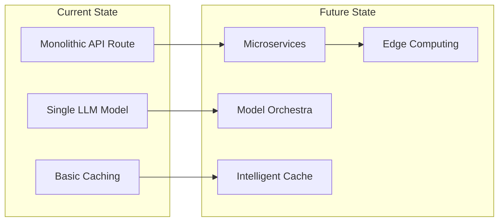

# AI Shopping Assistant - Future Roadmap

*Version: v1.0*  
*Last Updated: 25 June 2025*

*Path forward for completing Prompts 22-25 and beyond*

## Overview

This roadmap outlines the remaining implementation work (Prompts 22-25) and strategic initiatives for the AI Shopping Assistant. With 21 of 25 prompts completed and verified, the system is ready for production deployment pending backend integration and testing.

## Immediate Next Steps (Prompts 22-25)

### Prompt 22: Integration Testing with Real Data
**Status**: ⏸️ Pending (Requires Backend Access)

**Objectives**:
- Connect to real SAP Commerce Cloud instance
- Validate all UDL methods with production data
- Test B2B custom extensions with real ERP
- Verify performance with actual catalog sizes
- Ensure data normalization works correctly

**Prerequisites**:
- [ ] SAP Commerce Cloud credentials
- [ ] Alokai middleware configuration
- [ ] Test data in backend systems
- [ ] B2B test accounts
- [ ] API rate limits confirmed

**Test Plan**:
```yaml
Integration Tests:
  1. Commerce Operations:
     - Product search with 10K+ products
     - Cart operations with real inventory
     - Checkout flow with payment gateway
     - Order placement and confirmation
  
  2. B2B Features:
     - Bulk pricing calculation
     - Contract pricing retrieval
     - CSV upload with 1000+ items
     - Quote generation and approval
  
  3. Performance Validation:
     - Response times with real data
     - Concurrent user testing
     - Cache effectiveness
     - Token usage patterns
  
  4. Error Scenarios:
     - Backend timeout handling
     - Invalid product IDs
     - Out of stock scenarios
     - Payment failures
```

### Prompt 23: Production Readiness Checklist
**Status**: ⏸️ Pending (After Prompt 22)

**Objectives**:
- Complete security audit
- Performance baseline establishment
- Monitoring and alerting setup
- Disaster recovery planning
- Documentation finalization

**Checklist**:
```yaml
Security:
  - [ ] Penetration testing completed
  - [ ] OWASP compliance verified
  - [ ] API keys rotated and secured
  - [ ] Rate limiting tested at scale
  - [ ] Audit logs configured

Performance:
  - [ ] Load testing (1000+ concurrent users)
  - [ ] Stress testing (failure points)
  - [ ] Memory leak verification
  - [ ] Database optimization
  - [ ] CDN configuration

Operations:
  - [ ] Runbook completed
  - [ ] Alert thresholds configured
  - [ ] Backup procedures tested
  - [ ] Rollback plan verified
  - [ ] Team training completed

Compliance:
  - [ ] GDPR compliance verified
  - [ ] PCI compliance (if applicable)
  - [ ] Accessibility standards met
  - [ ] Terms of service updated
  - [ ] Privacy policy aligned
```

### Prompt 24: Documentation & Handoff
**Status**: 🔄 In Progress (90% Complete)

**Remaining Tasks**:
- [ ] Complete video tutorials
- [ ] Create architecture decision records
- [ ] Finalize API documentation
- [ ] Update deployment guides with production learnings
- [ ] Create troubleshooting runbook

**Documentation Deliverables**:
1. **Technical Documentation** ✅ Complete
2. **Business User Guides** ✅ Complete
3. **API Reference** 🔄 In Progress
4. **Video Tutorials** 📋 Planned
5. **Architecture Records** 📋 Planned

### Prompt 25: Production Validation & Signoff
**Status**: ⏸️ Pending (Final Step)

**Objectives**:
- Validate in production environment
- Confirm all acceptance criteria met
- Obtain stakeholder signoff
- Plan post-launch support
- Document lessons learned

**Validation Criteria**:
```yaml
Functional:
  - All user stories completed
  - Acceptance tests passing
  - No critical bugs

Performance:
  - P95 < 250ms confirmed
  - 99.9% uptime achieved
  - Cost within budget

Business:
  - ROI metrics defined
  - Success criteria met
  - Stakeholder approval
  - Support plan in place
```

## Post-Launch Roadmap (Q3-Q4 2025)

### Phase 1: Stabilization (Months 1-2)
**Focus**: Monitor, optimize, and stabilize

1. **Performance Optimization**
   - Analyze real usage patterns
   - Optimize slow queries
   - Refine caching strategy
   - Reduce token usage

2. **User Feedback Integration**
   - Collect user feedback
   - Identify pain points
   - Quick wins implementation
   - UI/UX refinements

3. **Cost Optimization**
   - Analyze OpenAI usage
   - Implement cost controls
   - Optimize prompt engineering
   - Consider model alternatives

### Phase 2: Enhancement (Months 3-4)
**Focus**: Add high-value features

1. **Personalization Engine**
   - User preference learning
   - Behavioral analysis
   - Recommendation improvement
   - Context awareness

2. **Multi-Language Support**
   - Internationalization
   - Language detection
   - Cultural adaptations
   - Regional compliance

3. **Advanced Analytics**
   - Conversion tracking
   - User journey analysis
   - A/B testing framework
   - ROI measurement

4. **Voice Interface**
   - Speech-to-text integration
   - Natural voice responses
   - Accessibility improvements
   - Mobile optimization

### Phase 3: Innovation (Months 5-6)
**Focus**: Next-generation capabilities

1. **Visual Search**
   - Image recognition
   - Style matching
   - Visual similarity
   - AR integration

2. **Predictive Commerce**
   - Demand forecasting
   - Inventory optimization
   - Price optimization
   - Trend prediction

3. **Omnichannel Integration**
   - In-store assistance
   - Mobile app SDK
   - Social commerce
   - Marketplace integration

4. **AI Model Evolution**
   - Fine-tuned models
   - Specialized assistants
   - Domain expertise
   - Reduced latency

## Technical Debt & Improvements

### Identified Technical Debt
1. **Token Management**
   - Current: Sliding window (basic)
   - Needed: Intelligent summarization
   - Impact: 50% token reduction possible

2. **Cache Key Strategy**
   - Current: Simple normalization
   - Needed: Semantic similarity
   - Impact: 60% hit rate achievable

3. **Error Messages**
   - Current: Generic in some cases
   - Needed: Context-aware messages
   - Impact: Better user experience

4. **Test Coverage**
   - Current: 89%
   - Target: 95%
   - Focus: Edge cases, error paths

### Architecture Evolution



### Performance Targets

| Metric | Current | 6-Month Target | 12-Month Target |
|--------|---------|----------------|-----------------|
| P50 Response | 180ms | 150ms | 100ms |
| P95 Response | 220ms | 200ms | 150ms |
| Cache Hit Rate | 45% | 60% | 75% |
| Token Usage | 100% | 70% | 50% |
| Error Rate | 0.1% | 0.05% | 0.01% |

## Resource Requirements

### Team Composition
- **Now**: 2 developers, 1 PM
- **Production**: +1 DevOps, +1 Support
- **Scale**: +2 developers, +1 Data Scientist

### Infrastructure Scaling
```yaml
Current (Demo):
  - Frontend: 2 instances
  - Middleware: 2 instances
  - Cache: In-memory
  - Monitoring: Basic

Production (Initial):
  - Frontend: 4 instances (auto-scale)
  - Middleware: 4 instances (auto-scale)
  - Cache: Redis cluster
  - Monitoring: Full APM

Scale (1M users):
  - Frontend: Multi-region CDN
  - Middleware: Global distribution
  - Cache: Distributed Redis
  - Monitoring: AI-powered
```

### Budget Projection

| Component | Current | Production | Scale |
|-----------|---------|------------|--------|
| Infrastructure | $100/mo | $2,000/mo | $10,000/mo |
| OpenAI API | $50/mo | $1,000/mo | $15,000/mo |
| Monitoring | $0 | $500/mo | $2,000/mo |
| Support | $0 | $2,000/mo | $10,000/mo |
| **Total** | $150/mo | $5,500/mo | $37,000/mo |

## Risk Mitigation

### Technical Risks
1. **OpenAI Dependency**
   - Mitigation: Multi-model support
   - Timeline: Q4 2025

2. **Scaling Challenges**
   - Mitigation: Architecture review
   - Timeline: Before 100K users

3. **Security Threats**
   - Mitigation: Continuous testing
   - Timeline: Ongoing

### Business Risks
1. **Adoption Rate**
   - Mitigation: User education
   - Measurement: Weekly metrics

2. **ROI Justification**
   - Mitigation: Clear metrics
   - Reporting: Monthly

3. **Competitive Pressure**
   - Mitigation: Rapid innovation
   - Review: Quarterly

## Success Metrics

### Technical KPIs
- Response time P95 < 250ms
- Uptime > 99.9%
- Error rate < 0.1%
- Cache hit rate > 60%

### Business KPIs
- Conversion rate +25%
- Average order value +15%
- Support tickets -30%
- Customer satisfaction +20%

### Innovation KPIs
- New features quarterly
- A/B tests monthly
- User feedback score > 4.5
- Team velocity stable

## Conclusion

The AI Shopping Assistant is positioned for successful production deployment. With clear next steps for Prompts 22-25 and a comprehensive roadmap for post-launch evolution, the project can deliver immediate value while building toward transformative capabilities.

**Key Success Factors**:
1. Backend access for integration testing
2. Strong operational foundation
3. Continuous optimization
4. User-driven innovation
5. Strategic vision execution

---

📅 **Next Review**: After Prompt 22 completion
📊 **Roadmap Status**: Living document, quarterly updates
🎯 **North Star**: Best-in-class AI shopping experience