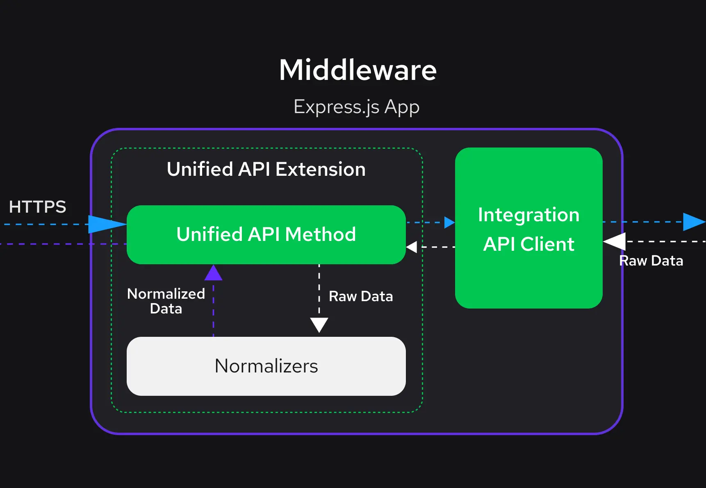

# Normalizers

::subheader
Normalizers allow different eCommerce platforms to work in the Unified Data Layer.
::

::info
The following guide is intended for `@vsf-enterprise/unfied-api-<integration>` version 1.0.0 and above.
Refer to the changelog (for example [`@vsf-enterprise/unified-api-sapcc`](https://docs.alokai.com/storefront/change-log/unified-api-sapcc)) if you are using an older version.
::

When working with eCommerce platforms, one common challenge is dealing with different data models and APIs. Each platform has its way of representing data, making it hard to switch platforms or work with multiple platforms simultaneously.

In the Unified Data Layer, normalizers helps solve this problem.

## What are Normalizers?

Think of a normalizer as a translator. It takes data from various eCommerce platforms, each speaking its own "data language", and translates it into a common language - the [Unified Data Model](/unified-data-layer/unified-data-model). This gives your storefront a standard format/structure to build on.

For example, regardless of the eCommerce platform, normalizers can transform product data into the Unified Data Model's `SfProduct` interface. This allows your storefront to build on a common data structure.

```ts
export interface SfProduct {
  id: SfId;
  sku: Maybe<string>;
  name: Maybe<string>;
  slug: string;
  description: Maybe<string>;
  price: Maybe<SfDiscountablePrice>;
  primaryImage: Maybe<SfImage>;
  gallery: SfImage[];
  rating: Maybe<{
    average: number;
    count: number;
  }>;
  variants: SfProductVariant[];
  attributes: SfAttribute[];
  quantityLimit: Maybe<number>;
}
```

## How Do Normalizers Work?

Each normalizer is a pure function, meaning it consistently produces the same output given the same input, without any side effects.

In practice, a normalizer takes two things:

1. Normalization Context: Think of this as the setting or environment. Sometimes, data needs to be interpreted in context – like what currency or language should be used. The normalization context provides this extra information.
2. eCommerce Entity: This is the raw data from an eCommerce platform. It could be information about products, prices, reviews, etc.

The normalizer's job is to transform this data into the Unified Data Model.

:::tip
Since Normalizers are pure functions, they can be easily tested. This is especially useful when working with custom normalizers.
:::

In the Alokai Storefront setup, normalizers sit between the eCommerce platforms (like SAP Commerce Cloud, Big Commerce, Salesforce, etc.) and your Storefront application. They are part of the Unified API Extension in the Middleware.



## Adding Data to Normalizers

Even though the Unified Data Model provides the most common eCommerce fields, there will be times when you want to add custom fields to the model.

When creating a Unified Extension, the `addCustomFields` property can be used to add custom fields to any normalizer. `addCustomFields` is an array of objects that use the same function name as the normalizer they are adding to.

In the example below, we extend the `normalizeProduct` normalizer with custom fields `description` and `type`. This way, you can add custom fields to the **Unified Data Model** without modifying the default normalizers.

To provide type safety for the extended normalizers, you can extend the `AddCustomFields` interface via the [declaration merging](https://www.typescriptlang.org/docs/handbook/declaration-merging.html) feature.

`InferAddCustomFields` utility type is a helper used to infer the type of the extended normalizers.

```ts [/integrations/<integration>/extensions/unified.ts]
import {
  type AddCustomFields,
  type InferAddCustomFields,
  createUnifiedExtension,
} from "@vsf-enterprise/unified-api-<integration>";

const unifiedApiExtension = createUnifiedExtension({
  normalizers: {
    addCustomFields: [
      {
        normalizeProduct(context, input) {
          return {
            description: input.description,
            type: input.type,
          };
        },
      },
      {
        normalizeMoney: () => ({
          formattedAmount: "overridden value",
        }),
      },
    ],
  },
});

declare module "@vsf-enterprise/unified-api-<integration>" {
  export interface AddCustomFields
    extends InferAddCustomFields<typeof unifiedApiExtension> {}
}
```

Now, in the frontend application, you can access the additional custom fields within the `$custom` property.

```ts
const product = await sdk.unifed.getProduct(productId);

// `description` and `type` are now available as part of $custom property
const { description, type } = product.$custom;
```

In the provided example we extended the normalizer with just two custom fields to make response small and lean. You can extend the normalizers with any number of custom fields to meet your business requirements, even the entire raw object.

```ts [/integrations/<integration>/extensions/unified.ts]
import {
  type AddCustomFields,
  type InferAddCustomFields,
  createUnifiedExtension,
} from "@vsf-enterprise/unified-api-<integration>";
import { Product } from "<commerce-types>";

const unifiedApiExtension = createUnifiedExtension({
  normalizers: {
    addCustomFields: [
      {
        normalizeProduct(context, input) {
          return {
            rawProduct: input,
          };
        },
      },
    ],
  },
});

declare module "@vsf-enterprise/unified-api-<integration>" {
  export interface AddCustomFields
    extends InferAddCustomFields<typeof unifiedApiExtension> {}
}
```

However, keep in mind that extending the normalizers with many fields may lead to performance issues due to overfetching and the large response size. Therefore, it's recommended to extend the normalizers with only the necessary fields.

### Using Normalizers in Custom Fields

In some cases, you may need to use the normalized data in custom fields. For example, you may want to add a custom field that specifies product availability based on the normalized value of quantity limit.

```ts
import {
  type InferAddCustomFields,
  createUnifiedExtension,
  normalizers as defaultNormalizers,
} from "@vsf-enterprise/unified-api-<integration>";

const unifiedApiExtension = createUnifiedExtension({
  normalizers: {
    addCustomFields: [
      {
        normalizeProduct(context, product) {
          const { quantityLimit } = defaultNormalizers.normalizeProduct(
            context,
            product
          );
          return {
            isAvailable: quantityLimit > 0,
          };
        },
      },
    ],
  },
});

declare module "@vsf-enterprise/unified-api-<integration>" {
  export interface AddCustomFields
    extends InferAddCustomFields<typeof unifiedApiExtension> {}
}
```

In the above example, we're using the `normalizeProduct` normalizer to get the normalized value of `quantityLimit`. Then, we're adding a custom field `isAvailable` that specifies whether the product is available based on the normalized value of `quantityLimit`.

::warning

When overriding a normalizer and referencing the original normalizer function make sure to call a function from the `normalizers` object. Using a contextualized normalizer function (e.g. `context.normalizers.normalizeProduct()`) may lead to unexpected behavior and infinite loops.

::

### Defining Custom Fields Separately

Writing all of your API code in the same file can make it harder to maintain. When you have a large number of custom fields, it could make sense to split up your custom fields into separate modules.

If you want to declare custom fields outside of your main extension file, the `defineAddCustomFields` utility can be used to define them.

```ts [/integrations/<integration>/extensions/custom-fields.ts]
import {
  defineAddCustomFields,
  type AddCustomFields,
} from "@vsf-enterprise/unified-api-<integration>";

const customProductFields = defineAddCustomFields({
  normalizeProduct(context, product) {
    return {
      isAvailable: product.stock?.stockLevel > 0,
    };
  },
});

const customCartFields = defineAddCustomFields({
  normalizeCart(context, cart) {
    return {
      total: cart.total,
    };
  },
});

export { customProductFields, customCartFields };
```

Then, you can import the custom fields in the main extension file and add them to the `addCustomFields`.

```ts [/integrations/<integration>/extensions/unified.ts]
import {
  createUnifiedExtension,
  AddCustomFields,
} from "@vsf-enterprise/unified-api-<integration>";
import { customProductFields, customCartFields } from "./custom-fields";

const extension = createUnifiedExtension({
  normalizers: {
    addCustomFields: [customProductFields, customCartFields],
  },
});
```

## Writing Normalizers

If you need to completely override an existing normalizer, you'll need to understand the internals of normalizers and how they work.

### Normalizer Anatomy

Let's take a look at a simple example of a normalizer.

```ts
import { Product } from "@vsf-enterprise/sapcc-types";

function normalizeRating(
  context: NormalizerContext,
  product: Product // <- raw product data
): Maybe<{ average: number; count: number }> {
  if (!isValidProductRating(product)) {
    return null;
  }
  return {
    average: product.averageRating,
    count: product.numberOfReviews,
  };
}
```

This normalizer transforms a product rating into the **Unified Data Model**. The normalizer accepts a [normalization context](#normalizer-context) and raw product data as arguments and returns an object with the `average` and `count` properties, following the Unified Data Model structure.

This is an example of a helper normalizer that is used by other normalizers to transform product data. Let's take a look at a more complex example.

```ts
// SAP Commerce Cloud specific Product Type
import { Product } from "@vsf-enterprise/sapcc-types";
// Unified Data Model SfProductCatalogItem type
import { SfProductCatalogItem } from "@vsf-enterprise/unified-api-<integration>";

// ...other imports

function normalizeProductCatalogItem(
  context: NormalizerContext,
  product: Product
): SfProductCatalogItem {
  const id = product.code;
  const { primaryImage } = createSfImages(product.images, context);
  const price = context.normalizers.normalizeDiscountablePrice(product.price);
  const rating = context.normalizers.normalizeRating(product); // the rating normalizer from the previous example
  return {
    id,
    sku: maybe(product?.code),
    name: product.name ? sanitizeHtml__default(product.name) : null,
    slug: slugify(id, product?.name ?? ""),
    price,
    primaryImage,
    rating,
    quantityLimit: maybe(product.stock?.stockLevel),
  };
}
```

The above example is a normalizer that transforms SAP Commerce Cloud specific product data into the **Unified Data Model**. Then, it uses other normalizers and helper functions to transform SAPCC data into the **Unified Data Model**. The normalizer then returns a **Unified Data Model** compliant to `SfProductCatalogItem` interface.

### Normalizer Context

The normalizer context is an object that provides additional information to the normalizer that allows it to transform the data properly. For example, the normalizer context can provide information about the currency, language, or other settings that are required to normalize the data correctly.

The normalizer context is available as the first argument on the normalizer function.

```ts
function normalizeProduct(
  context: NormalizerContext,
  product: Product
): SfProductCatalogItem {
  const { currency, locale } = context;
  // format product price using currency and locale
  const price = new Intl.NumberFormat(locale, {
    style: "currency",
    currency,
  }).format(product.price);

  return {
    price,
    //... other normalized product data
  };
}
```

Normalization context provides also easy access to other normalizers functions:

```ts
function normalizeProduct(
  context: NormalizerContext,
  product: Product
): SfProductCatalogItem {
  const normalizedPrice = context.normalizers.normalizePrice(product.price);

  return {
    price: normalizedPrice,
    //... other normalized product data
  };
}
```

Default fields available in the normalizer context may differ depending on the integration.
You can enhance the normalizer context with additional properties to provide more information to the normalizers.

#### Enhancing Normalizer Context

The normalizer context can be enhanced with additional properties to provide more information to the normalizers. For example, you can add an `sku` property to the normalizer context to provide information about the product sku or variant that should be used to normalize the data.

Use the `assignToNormalizerContext` helper function to enhance the normalizer context with additional properties. This function mutates the normalizer context object by adding the specified properties.

```ts
import {
  assignToNormalizerContext,
  getNormalizers,
} from "@vsf-enterprise/unified-api-<integration>";

declare module "@vsf-enterprise/unified-api-<integration>" {
  interface NormalizerContext {
    sku?: string;
  }
}

async function getProduct(context, args) {
  const product = await context.api.getProduct({ id: productId.id });
  const { normalizeProduct } = getNormalizers(context);

  assignToNormalizerContext(context, {
    sku: product.sku,
  });
  return normalizeProduct(product);
}
```

### Overriding Normalizers

After understanding how normalizers work, you can override them. This is useful when you need to replace the default behavior of a normalizer with your custom logic. In the example below, we're overriding the `normalizeProduct` normalizer with a custom implementation. This way, you can replace the default behavior of the `normalizeProduct` normalizer with your custom logic.

:::warning Overriding normalizers should not change the data structure

When overriding a normalizer, make sure to return the expected output format compliant to the Unified Data Layer. Otherwise, you may encounter unexpected behavior in your application. If you want to [add custom fields](#adding-data-to-normalizers), use the `addCustomFields` property instead.

:::

```ts [/integrations/<integration>/extensions/unified.ts]
import {
  createUnifiedExtension,
  normalizers as defaultNormalizers,
} from "@vsf-enterprise/unified-api-<integration>";

const extension = createUnifiedExtension({
  normalizers: {
    override: {
      normalizeProduct(context, product) {
        // normalize the product using the default normalizer
        const normalizedProduct = defaultNormalizers.normalizeProduct(
          context,
          product
        );
        // override fields of the normalized product
        const price = context.normalizers.normalizePrice(product.price);
        return {
          ...normalizedProduct,
          price,
          id: product.name + product.id,
          name: product.name.toUpperCase(),
        };
      },
    },
  },
});
```

Like Custom Fields, it's possible to define normalizers in a separate module and import them in the main extension file using the `defineNormalizer` factory function.

```ts [/integrations/<integration>/extensions/custom-normalizers.ts]
import {
  defineNormalizer,
  normalizers as defaultNormalizers,
} from "@vsf-enterprise/unified-api-<integration>";

const normalizeProduct = defineNormalizer.normalizeProduct((context, input) => {
  const product = defaultNormalizers.normalizeProduct(input);
  return {
    ...product,
    id: input.name + input.id,
    name: input.name.toUpperCase(),
  };
});

export { normalizeProduct };
```

Then, you can import the custom normalizers in the main extension file and add them to the `override` object.

```ts [/integrations/<integration>/extensions/unified.ts]
import {
  createUnifiedExtension,
  normalizers,
} from "@vsf-enterprise/unified-api-<integration>";
import { normalizeProduct } from "./custom-normalizers";

const extension = createUnifiedExtension({
  normalizers: {
    override: {
      normalizeProduct,
    },
  },
});
```
