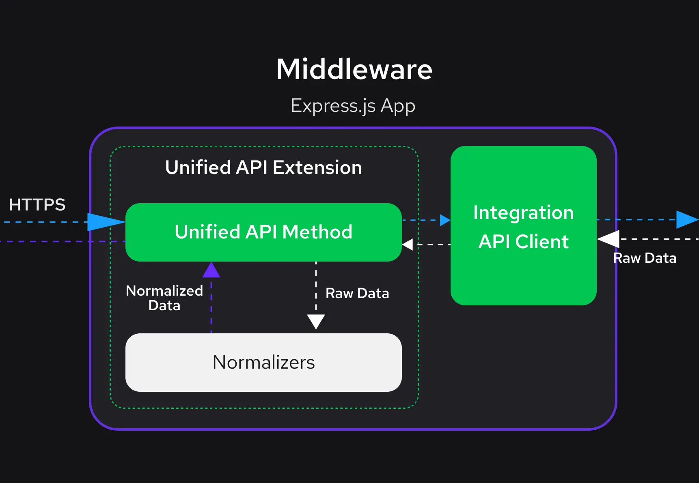

# Normalizers

When working with eCommerce platforms, one common challenge is dealing with different data models and APIs. Each platform has its way of representing data, making it hard to switch platforms or work with multiple platforms simultaneously. Here's where **normalizers** become incredibly useful.

## What Exactly is a Normalizer?

Think of a normalizer as a translator. Its job is to take data from various eCommerce platforms, each speaking its own "data language," and translate it into a common language. This common language is known as the [Unified Data Model](/unified-data-layer/unified-data-model), a standard format that our system understands regardless of the data source.

## The Role of Normalizers

Normalizers are like the heart of the **Unified Data Layer**. The **Unified Data Layer** is designed to work with data from any eCommerce platform. But for this to work, the data from these different sources must be translated into a format that the **Unified Data Layer** can understand. That's exactly what **normalizers** do.

## How Do Normalizers Work?

Each normalizer is a pure function. This means it consistently produces the same output given the same input, without any side effects. 

In practice, a normalizer takes two things:

- eCommerce Entity: This is the raw data from an eCommerce platform. It could be information about products, prices, reviews, etc.
- Normalization Context (optional): Think of this as the setting or environment. Sometimes, data needs to be interpreted in context – like what currency or language should be used. The normalization context provides this extra information.

The normalizer's job is to carefully map or translate this data into the Unified Data Model.

:::tip
**Normalizers** are pure functions, which means that they can be easily tested. This is especially useful when extending the **normalizers** object with custom **normalizers**.
:::

## Where Do Normalizers Fit?

In the Alokai Storefront setup, normalizers sit between the eCommerce platforms (like SAP Commerce Cloud, Big Commerce, Salesforce, etc.) and your Storefront application. They are part of the Unified API Extension in the Middleware, the central hub of this architecture.

## How Do They Work in This Setup?

1. Receiving Data: When your Storefront sends a request for product information, it goes through the Middleware. The request is directed to the specific eCommerce platform you're integrated with.

2. Translation Time: This is where normalizers come into play. The eCommerce platform responds with its unique data format, which might be quite different from what your Storefront expects. Normalizers take this raw, platform-specific data and translate it into a common format - the Unified Data Model.




## Normalizer Anatomy

Let's take a look at a simple example of a **normalizer**:

```ts
import { Product } from '@vsf-enterprise/sapcc-types';

function normalizeRating(product: Product): Maybe<{ average: number; count: number; }> {
  if (!isValidProductRating(product)) {
    return null;
  }
  return {
    average: product.averageRating,
    count: product.numberOfReviews
  };
}
```

The above example is a **normalizer** that transforms a product rating into a **Unified Data Model**. The **normalizer** accepts a product as the first argument and returns an object with the `average` and `count` properties. If the product rating is invalid, the **normalizer** returns `null`.

This is a low-level, helper **normalizer** that is used by other **normalizers** to transform product data. Let's take a look at a more complex example of **global normalizer**:

```ts
// SAP Commerce Cloud specific Product Type
import { Product } from '@vsf-enterprise/sapcc-types';
// Unified Data Model SfProductCatalogItem type
import { SfProductCatalogItem } from '@vue-storefront/unified-data-model';

// ...other imports

function normalizeProductCatalogItem(product: Product, ctx: NormalizerContext): SfProductCatalogItem {
  const id = product.code;
  const { primaryImage } = createSfImages(product.images, ctx);
  const price = normalizeDiscountablePrice(product.price);
  const rating = normalizeRating(product);
  return {
    id,
    sku: maybe(product?.code),
    name: product.name ? sanitizeHtml__default(product.name) : null,
    slug: slugify(id, product?.name ?? ""),
    price,
    primaryImage,
    rating,
    quantityLimit: maybe(product.stock?.stockLevel)
  };
}
```

The above example is a **normalizer** that transforms SAP Commerce Cloud specific product data into the **Unified Data Model**. The **normalizer** accepts a product as the first argument and a normalization context as the second argument. Then, it uses other **normalizers** and helper functions to transform SAPCC data into the **Unified Data Model**. The **normalizer** then returns a **Unified Data Model** compliant `SfProductCatalogItem` object.

## Extending Normalizers

It’s worth mentioning that while the **normalized** data serves a common purpose, we acknowledge that business requirements may vary. Therefore, we provide a mechanism to extend these **normalizers**, ensuring flexibility to meet your needs.

In order to extend **normalizer** functionality, you can use the `defineNormalizers` function. This function accepts a generic type that defines the shape of the **normalizers** object. This allows you to extend the **normalizers** object with your own custom **normalizers**. 

In the example below, we show how to extend the **normalizers** object with custom `normalizeProductCatalogItem` **normalizer**. This **normalizer** adds the `description` property to the **Unified Data Model**.

```ts
import { normalizers as normalizersSAP, defineNormalizers } from "@vsf-enterprise/unified-api-sapcc";

const normalizers = defineNormalizers<typeof normalizersSAP>()({
  ...normalizersSAP,
  normalizeProductCatalogItem: (product, context) => ({
    ...normalizersSAP.normalizeProductCatalogItem(product, context),
    description: product.description,
  }),
});
```

Since the `normalizeProductCatalogItem` **normalizer** is used by [Unified Methods](/unified-data-layer#unified-methods), the `description` property will be available in the `getProduct` method response.

:::tip
Global **normalizers** depend on other low-level **normalizers** and helper functions, like `normalizeRating` in the example above.

<br>

If you want to extend a low-level **normalizer** and to have its effet on other **normalizers**, you need to extend the **normalizers** object with a new **normalizer** that uses the **extended** low-level **normalizer**.
:::

You can find all eCommerce platfrom specific **normalizers** and their extensions documentation in the **Reference** section.