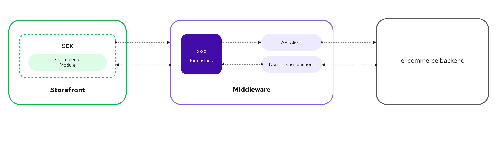

# Unified Data Layer

::subheader
Learn how the Unified Data Layer can help you build storefronts.
::

In the world of eCommerce, businesses often find themselves shifting between various platforms like commercetools, SAP Commerce Cloud, BigCommerce, and others.

Since each platform has its own unique data structure and APIs, migrating from one platform to another can be a long and error-prone process. The Unified Data Layer can help you solve this challenge by providing standardized data structures and methods that work across multiple platforms.

The Unified Data Layer helps standardize two key aspects of eCommerce applications:

1. **Unified Data Model** - standardized data structures for common eCommerce elements
2. **Unified Methods** - standardized API calls for eCommerce operations

## Unified Data Model

The Unified Data Model (UDM) is a collection of standardized data structures for common eCommerce elements like products, categories, customers, and more. It provides a consistent way for your application to interact with data, regardless of the eCommerce platform you're using.

For example, the UDM defines an `SfProduct` interface for product data. Under the hood, the Unified Data Layer normalizes product data from each platform into this common format.

This means that regardless of the platform, the product data will be represented in the same way. So if you're migrating from one platform to another, the number of changes you'll need to make to your storefront will be significantly reduced.

```ts
interface SfProduct {
  id: SfId;
  sku: Maybe<string>;
  name: Maybe<string>;
  slug: string;
  description: Maybe<string>;
  price: Maybe<SfDiscountablePrice>;
  primaryImage: Maybe<SfImage>;
  gallery: SfImage[];
  rating: Maybe<{
    average: number;
    count: number;
  }>;
  variants: SfProductVariant[];
  attributes: SfAttribute[];
  quantityLimit: Maybe<number>;
}
```

### The Significance of the Unified Data Model

In eCommerce, the ability to swiftly and accurately process, analyze, and present data is key to success. The UDL provides a structured way to manage this data, ensuring that regardless of the platform — be it Commercetools, SAPCC, or BigCommerce — the data is consistently represented. It empowers businesses to deliver an optimal user experience by accurately capturing and representing product data, providing detailed product information, reliable ratings and reviews, precise pricing, and smooth checkout experiences.

The UDL, while serving as a comprehensive starting point, is not a one-size-fits-all solution. Each business will have unique data needs, and the model should be customized to suit these specific requirements. The true power of the UDL lies in its adaptability and scalability. It's a dynamic model that can be tailored as per the needs of your business, while ensuring data consistency and efficiency.

## Unified Methods

Unified Methods are a set of standardized API calls designed to perform key eCommerce operations consistently across different platforms. It serves as an abstraction layer that allows you to work with different eCommerce platforms using the same set of methods.

Each method works with the Unified Data Model, so both the arguments and the return values are standardized. Internally, each unified integration implements these methods by formatting the requests to the specific eCommerce platform (renaming fields, structuring the request body, etc.) and then normalizing the response from the platform to fit the Unified Data Model.

For example, the `getProducts` method returns a list of `SfProduct` objects. Each unified integration implements this method slightly differently, but the inputs/outputs will follow the same structure.

```ts
const { products } = await sdk.unified.getProducts({
  ids: ["PRODUCT-ID"],
});
```

## How It Works

The Unified Data Layer integrates into the Alokai architecture in two ways, extending both the SDK and the middleware:

1. **middlewareModule** - the SDK module allows the frontend application to call the Unified Methods in a type-safe way.
2. **Unified API Extension** - middleware extension that implements the Unified Methods for a specific platform by formatting requests to the service and normalizing responses to match the Unified Data Model.

::steps
#step-1
From a frontend application, the SDK `middlewareModule` calls one of the Unified Methods.
#step-2
This Unified Method is implemented in the middleware, which uses a Unified API Extension to format the request and call the respective eCommerce backend.
#step-3
The response from the eCommerce backend is sent to the middleware.
#step-4
The middleware uses the specific normalizer for the eCommerce backend to transform the data to fit the Unified Data Model and sends it back to the frontend application.
::



## Extending the Unified Data Layer

The Unified Data Layer is designed to be extensible. This means that you can add new data structures and methods to the UDL to support your specific business needs.

For example, you can override Unified Methods, extend the Unified Data Model, override normalizers, and more. This allows you to customize the Unified Data Layer to fit your exact requirements.
